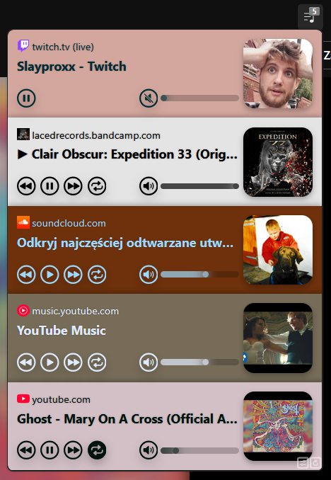
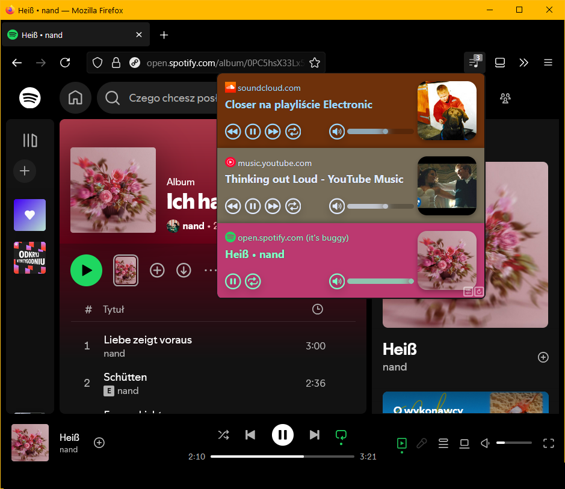

  

<h1 align="center">Firefox extension for media control</h1>

  
  

  

A Firefox browser extension that lets you globally control media playbacks across tabs in a
single place at the toolbar, similar to Chrome's [media control button](https://support.google.com/chrome/answer/9692215?hl=en).

Improvements vibe-coded on top of [Tony Chan's extension](https://github.com/tnychn/media-controller-extension).

new features:
- share button which generates qr code to scan and/or paste url (for PictureInPicture or cast feature from other apps)
- live badge for stream media + limited controls (forward, backward, loop excluded)
- loop current media button
- volume slider with mouse scroll support
- improved thumbnail fetch for Spotify, Twitch and SoundCloud
- slight UI redesign
- Spotify support (a bit buggy)
- options page: hide thumbnails, set media duration for live media
- keyboard shortcut to open extension and mute all media
---

  <strong>original version: MIT © 2024 Tony Chan</strong>

